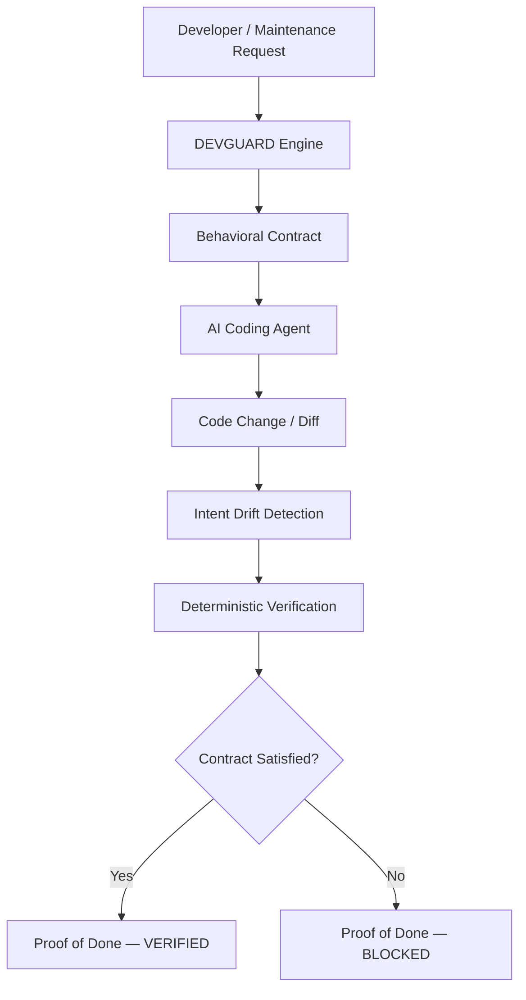

# DEVGUARD 2.0

**Behavioral Safety for AI-Assisted Software Maintenance**

---

## What Is DEVGUARD?

DEVGUARD is a behavioral safety and verification control plane for AI-assisted software maintenance.

When an AI coding agent modifies a codebase, it may successfully implement the requested change while unintentionally altering a different existing business rule. DEVGUARD addresses the gap between two questions that are often conflated:

> "Did the AI implement the requested change?"

and

> "Did the AI unintentionally change behavior that was supposed to remain protected?"

DEVGUARD answers the second question deterministically.

It establishes a behavioral baseline from the existing codebase, defines what is allowed to change, protects all other existing behaviors, detects unintended behavioral drift in the AI's output, runs deterministic verification against the behavioral contract, and produces a cryptographically-linked **Proof of Done**.

DEVGUARD is **not** a chatbot. It is not a generic AI coding assistant. It is a verification and accountability layer that sits between a maintenance request and the codebase it targets.

---

## The Problem

AI coding agents are increasingly capable of making real software changes. However, they operate on local context and do not inherently understand or preserve all the behavioral invariants of an existing system.

**Example:** A developer asks an AI agent to increase the Enterprise customer discount from 10% to 15%. The agent does so — correctly. But it also inadvertently changes the Loyalty discount from 10% to 15%, because the two constants share similar names and structure in the source file.

The change compiles. Linting passes. The agent's stated intent looks correct. Yet a protected business rule has been silently broken.

Without a behavioral contract and deterministic verification, this regression ships.

---

## How DEVGUARD Works

DEVGUARD runs a sequential pipeline. Each phase produces a structured artifact.

```
Repository
    │
    ▼
[ understand.py ]        Python AST-based static analysis
    │                    → module structure, functions, entry points
    ▼
[ behavior_map.py ]      Behavior extraction
    │                    → named behaviors with IDs, descriptions, modules
    ▼
[ evidence.py ]          SHA-256 provenance baseline
    │                    → hash of every source and test file before any change
    ▼
Maintenance Request
    │
    ▼
[ contract.py ]          Behavioral Contract
    │                    → allowed changes, protected behaviors, invariants
    ▼
[ impact.py ]            Impact Analysis
    │                    → at-risk behaviors, affected files, risk summary
    ▼
[ bob_task.py ]          BobTask Assembly
    │                    → structured handoff package for the coding agent
    ▼
AI Coding Agent (IBM Bob / mock / other)
    │
    ▼
Code Change / Diff
    │
    ▼
[ drift_detector.py ]    Intent Drift Detection
    │                    → compares original request to proposed diff
    │                    → flags unintended changes to protected behaviors
    ▼
[ verifier.py ]          Deterministic Verification
    │                    → isolated working copy
    │                    → applies diff, runs pytest, parses results
    │                    → maps test failures to violated contract clauses
    ▼
[ proof.py ]             Proof of Done
                         → SHA-256 hash chain across all artifacts
                         → VERIFIED or BLOCKED final status
```

DEVGUARD never modifies the canonical source directory. All mutations happen in an isolated working copy.

---

## Architecture



**Frontend → FastAPI REST API (`api/main.py`) → DEVGUARD Engine (`devguard/*.py`) → `sample_app/` (read-only)**

### Python Modules (`devguard/`)

| Module | Role |
|---|---|
| `understand.py` | Python AST-based project analysis |
| `behavior_map.py` | Behavior extraction and naming |
| `evidence.py` | SHA-256 provenance and baseline |
| `contract.py` | Behavioral contract construction |
| `impact.py` | Impact and risk analysis |
| `bob_task.py` | BobTask assembly and prompt generation |
| `bob_executor.py` | Swappable coding-agent executor interface |
| `drift_detector.py` | Intent drift detection |
| `verifier.py` | Deterministic test-based verification |
| `proof.py` | Proof of Done with SHA-256 hash chain |

---

## LegacyShop — The Controlled Sample Application

**LegacyShop is the controlled sample legacy application used to demonstrate DEVGUARD. DEVGUARD is the product. LegacyShop is not the product.**

LegacyShop is a Python e-commerce application with realistic business logic. It serves as the subject application that DEVGUARD analyzes, contracts, and verifies changes against.

### LegacyShop Business Behaviors (confirmed from source)

| Module | Behavior |
|---|---|
| `customers.py` | Customer types: `NEW` (5% discount), `LOYALTY` (10%), `ENTERPRISE` (10% global default) |
| `discount.py` | Discount pipeline: customer discount → coupon → (tax handled separately) |
| `discount.py` | Coupon types: `FIXED` (flat dollar off) and `PERCENTAGE` (fraction off) |
| `discount.py` | Expired coupons are rejected; result is floored at $0.00 |
| `tax.py` | Tax calculated last, on the post-discount amount (default rate: 8.5%) |
| `checkout.py` | Orders cannot be placed on an empty cart or with insufficient stock |
| `refunds.py` | Full and partial refunds; partial refund uses proportional calculation |
| `cart.py` | Duplicate SKU additions increment quantity; do not create duplicate lines |

The three customer discount constants are intentionally similar:

```python
# customers.py
NEW_CUSTOMER_DISCOUNT: float = 0.05   # 5%  — new customer benefit
LOYALTY_DISCOUNT: float      = 0.10   # 10% — loyalty programme rate
ENTERPRISE_DISCOUNT: float   = 0.10   # 10% — enterprise contract rate (initial)
```

These are independent constants. A change to one must not affect the others. This independence invariant is the core behavioral contract clause verified in the DEVGUARD demonstration.

---

## The Demonstration

### Maintenance Request

> *"Update the Enterprise discount rate from 10% to 15% to match the new pricing policy."*

DEVGUARD builds a **Behavioral Contract** for this request:

- **Allowed to change:** `ENTERPRISE_DISCOUNT` in `customers.py` — `0.10 → 0.15`
- **Protected behaviors (must remain unchanged):**
  - Loyalty discount rate (`LOYALTY_DISCOUNT = 0.10`)
  - Tax calculation (8.5% on post-discount amount)
  - Coupon application ordering (customer discount first, then coupon)
  - Refund calculation (proportional formula)

---

### Controlled Failure

The AI coding agent (or mock executor) produces a diff that correctly raises the Enterprise discount but also accidentally raises the Loyalty discount:

```
ENTERPRISE_DISCOUNT: 0.10 → 0.15   ✓ INTENDED
LOYALTY_DISCOUNT:    0.10 → 0.15   ✗ UNINTENDED
```

DEVGUARD's drift detector flags the unintended change to a protected behavior.

DEVGUARD's verifier applies the diff to an isolated working copy, runs the test suite, and the following tests fail:

- `test_loyalty_discount_is_10_percent`
- `test_loyalty_customer_rate`
- `test_loyalty_customer_100_dollar_order_discount`
- `test_loyalty_customer_10pct_discount`
- `test_discount_rates_are_independent`

**Result:**

```
INTENT DRIFT DETECTED
Contract clause violated: Loyalty discount rate independence
Verification status: BLOCKED
```

The Proof of Done records the full evidence trail — request, contract, diff, drift result, test failures, violated clause — and returns a `BLOCKED` status.

> This is a controlled demonstration scenario. The "bad" diff is a pre-written fixture (`fixtures/bob_mock_response.json`) that reliably reproduces the failure for demo and evaluation purposes.

---

### Corrected Verification

After correcting the unintended Loyalty change (only `ENTERPRISE_DISCOUNT` is modified):

```
ENTERPRISE_DISCOUNT: 0.10 → 0.15   ✓ INTENDED
LOYALTY_DISCOUNT:    0.10           ✓ UNCHANGED
```

DEVGUARD's verifier:
1. Creates an isolated working copy of `sample_app/`
2. Applies the corrected diff
3. Runs the full pytest suite against the working copy
4. Confirms all protected-behavior tests pass
5. Maps results to contract clauses — no violations found

**Result:**

```
No intent drift detected
All behavioral contract clauses satisfied
Verification status: VERIFIED
```

The Proof of Done records `VERIFIED` with the complete evidence chain.

---

## Proof of Done

The Proof of Done connects every step in the pipeline into a single tamper-evident record:

| Component | Content |
|---|---|
| Maintenance request | What was asked and by whom |
| Behavioral contract | What was allowed to change; what was protected |
| Bob response | The proposed diff and stated intent |
| Intent drift result | Whether protected behaviors were flagged |
| Verification result | Test counts, failing test IDs, contract verdict |
| Test evidence | Pytest output from the isolated working copy |
| SHA-256 hash chain | Cryptographic linkage across all artifacts |
| Final status | `VERIFIED` or `BLOCKED` |

The purpose of the Proof of Done is to provide a complete, auditable evidence trail for why a change was accepted or blocked — not merely that it was.

---

## IBM Bob 2.0

IBM Bob 2.0 was used as the primary AI development agent during the creation of the DEVGUARD prototype.

IBM Bob is also the demonstrated coding and maintenance agent in the hackathon workflow. The distinction is:

| Role | Tool |
|---|---|
| Coding / maintenance agent | IBM Bob 2.0 |
| Behavioral safety and verification layer | DEVGUARD |

DEVGUARD does not claim a direct programmatic IBM Bob API integration. The Bob integration in this prototype uses a `BobExecutor` interface with three configurable backends, selected at runtime via the `BOB_BACKEND` environment variable:

| Backend | Description |
|---|---|
| `mock` | Uses `fixtures/bob_mock_response.json` — reliable, offline, no API required |
| `watsonx_llm` | Uses IBM watsonx.ai LLM with a Bob-persona system prompt |
| `watsonx_agent` | Reserved for future IBM Bob Agents API integration |

---

## Agent-Agnostic Design

> "The integration point is the software change, not the AI vendor."

The current hackathon demonstration uses IBM Bob as the coding agent. The underlying DEVGUARD concept is designed to be agent-agnostic because DEVGUARD evaluates the **resulting software change and behavioral outcome**, not how the change was produced.

DEVGUARD analyzes the diff. It does not depend on which agent created it.

Future integration paths could include:
- Git diffs and Pull Requests
- CLI integration (pipe a diff to DEVGUARD)
- IDE integrations
- Adapters for agents such as OpenAI Codex, Anthropic Claude Code, Google Gemini CLI, or other coding agents

> These are potential future integrations. None are currently implemented.

---

## REST API

The DEVGUARD backend exposes a FastAPI REST API. All pipeline phases are accessible as independent endpoints.

**Start the server:**
```bash
python -m uvicorn api.main:app --reload --port 8000
```

**Interactive docs:** [http://localhost:8000/docs](http://localhost:8000/docs)  
**OpenAPI schema:** [http://localhost:8000/openapi.json](http://localhost:8000/openapi.json)

### Endpoints

| Method | Path | Description |
|---|---|---|
| `GET` | `/api/health` | Health check — confirms API is running |
| `POST` | `/api/repository/analyze` | Phase 1 — Python AST project understanding |
| `POST` | `/api/maintenance` | Phase 2 — Construct a structured MaintenanceRequest |
| `POST` | `/api/contract` | Phases 1–3 — Build the Behavioral Contract |
| `POST` | `/api/impact` | Phases 1–4 — Impact and risk analysis |
| `POST` | `/api/bob-task` | Phases 1–5 — Assemble the BobTask handoff package |
| `POST` | `/api/drift` | Phases 1–5b — Run Bob execution and detect intent drift |
| `POST` | `/api/verify` | Phases 1–6a — Full verification including test run |
| `GET` | `/api/proof` | Full pipeline — Proof of Done (triggers pytest) |
| `GET` | `/docs` | Swagger UI |
| `GET` | `/openapi.json` | OpenAPI schema |

All `POST` endpoints accept optional request bodies. Omitting the body uses the canonical Enterprise discount demonstration defaults.

---

## Technology Stack

| Layer | Technology |
|---|---|
| Backend language | Python 3.11+ |
| Web framework | FastAPI |
| ASGI server | Uvicorn |
| Static analysis | Python `ast` (stdlib) |
| Provenance | SHA-256 via Python `hashlib` (stdlib) |
| Schema validation | Pydantic |
| Test runner | Pytest |
| Frontend language | TypeScript / React 19 |
| Frontend build | Vite |
| UI component library | Radix UI |
| Frontend server | Express (Node.js) |
| Package manager | pnpm |
| AI development agent | IBM Bob 2.0 |

---

## Testing

The test suite spans three test directories, configured in `pytest.ini`:

```
testpaths = sample_app/tests  devguard/tests  api/tests
```

LegacyShop test files:
- `test_catalog.py`, `test_cart.py`, `test_checkout.py`, `test_customers.py`
- `test_discount.py`, `test_tax.py`, `test_refunds.py`

The controlled failure scenario is detected by tests in `test_customers.py`, including:
- `test_loyalty_discount_is_10_percent`
- `test_discount_rates_are_independent`

---

## Repository Structure

```
devguard/
├── api/
│   └── main.py                 # FastAPI REST API
├── client/
│   ├── index.html
│   └── src/                    # React TypeScript frontend
├── devguard/
│   ├── understand.py           # AST-based project analysis
│   ├── behavior_map.py         # Behavior extraction
│   ├── evidence.py             # SHA-256 provenance
│   ├── contract.py             # Behavioral contract
│   ├── impact.py               # Impact analysis
│   ├── bob_task.py             # BobTask assembly
│   ├── bob_executor.py         # Swappable agent executor
│   ├── drift_detector.py       # Intent drift detection
│   ├── verifier.py             # Deterministic verification
│   ├── proof.py                # Proof of Done / hash chain
│   └── tests/
├── sample_app/                 # LegacyShop (read-only subject application)
│   ├── customers.py            # Customer types and discount constants
│   ├── discount.py             # Discount and coupon logic
│   ├── tax.py                  # Tax calculation
│   ├── checkout.py             # Order placement
│   ├── cart.py                 # Cart operations
│   ├── catalog.py              # Product catalog
│   ├── refunds.py              # Refund logic
│   ├── BUSINESS_RULES.md       # Authoritative business rules reference
│   └── tests/
├── server/
│   └── index.ts                # Express server (production frontend serving)
├── patches/                    # pnpm package patches
├── requirements.txt
├── package.json
├── pytest.ini
└── .env.example
```

---

## Getting Started

### Prerequisites

- Python 3.11+
- Node.js + pnpm (for the frontend)

### Backend

```bash
# Install Python dependencies
pip install -r requirements.txt

# Start the DEVGUARD API server
python -m uvicorn api.main:app --reload --port 8000
```

API docs available at: [http://localhost:8000/docs](http://localhost:8000/docs)

### Frontend

```bash
# Install frontend dependencies
pnpm install

# Start the development server
pnpm dev
```

### Environment

Copy `.env.example` to `.env` and configure:

```bash
BOB_BACKEND=mock    # 'mock' works with zero external dependencies
```

Set `BOB_BACKEND=mock` to run the full demonstration without any external API keys.

---

## Public Demo

| Resource | URL |
|---|---|
| GitHub | [https://github.com/Apzrai/devguard-2](https://github.com/Apzrai/devguard-2) |
| Frontend | [https://devguard-fhmnx4zr.manus.space](https://devguard-fhmnx4zr.manus.space) |
| Backend API | [https://devguard-2.onrender.com](https://devguard-2.onrender.com) |

---

## Current Scope vs. Future Work

### Currently Implemented

- DEVGUARD behavioral analysis (understand → behavior map → evidence)
- Behavioral contract construction
- Impact analysis
- IBM Bob demonstration (mock executor and watsonx_llm executor)
- Intent drift detection
- Deterministic verification (pytest-based, isolated working copy)
- Proof of Done with SHA-256 hash chain
- FastAPI REST API (9 endpoints)
- React/TypeScript frontend

### Potential Future Work

- Git diff and Pull Request integration
- CLI interface for pipeline execution
- IDE plugin integration
- Adapters for additional coding agents
- Database-backed artifact storage
- Parallel pipeline execution

---

## Limitations

DEVGUARD does not claim to mathematically prove every possible behavior of arbitrary software. Its verification operates within the behavioral boundaries, evidence, tests, and implementation currently available.

The strength of the behavioral contract depends on the completeness of the existing test suite. DEVGUARD cannot detect regressions for behaviors that have no corresponding tests.

The intent drift detection and behavior map steps use watsonx.ai for analysis. The verification verdict (`PASS` / `FAIL`) is always determined deterministically by pytest results — not by the AI.

---

*Let AI change the code. Make behavior accountable.*
